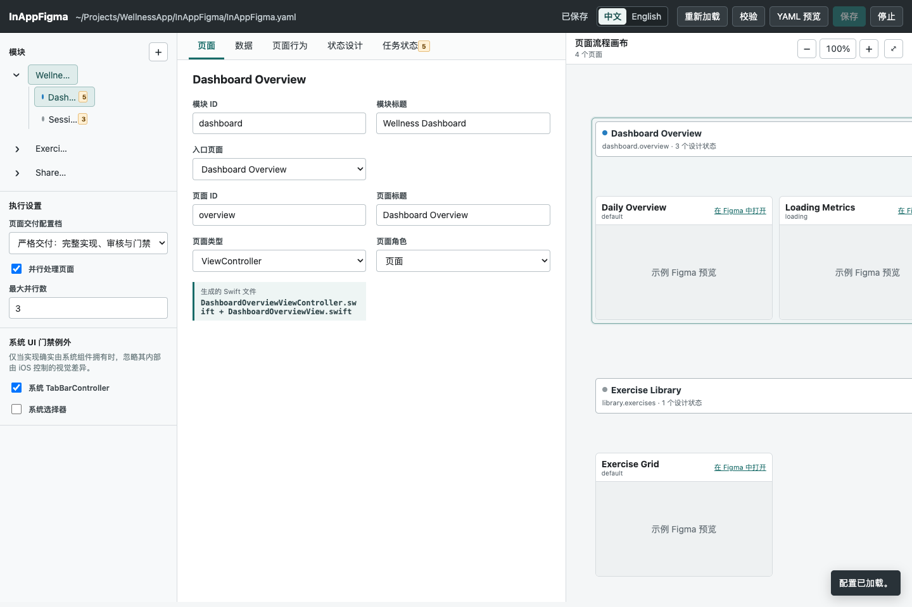
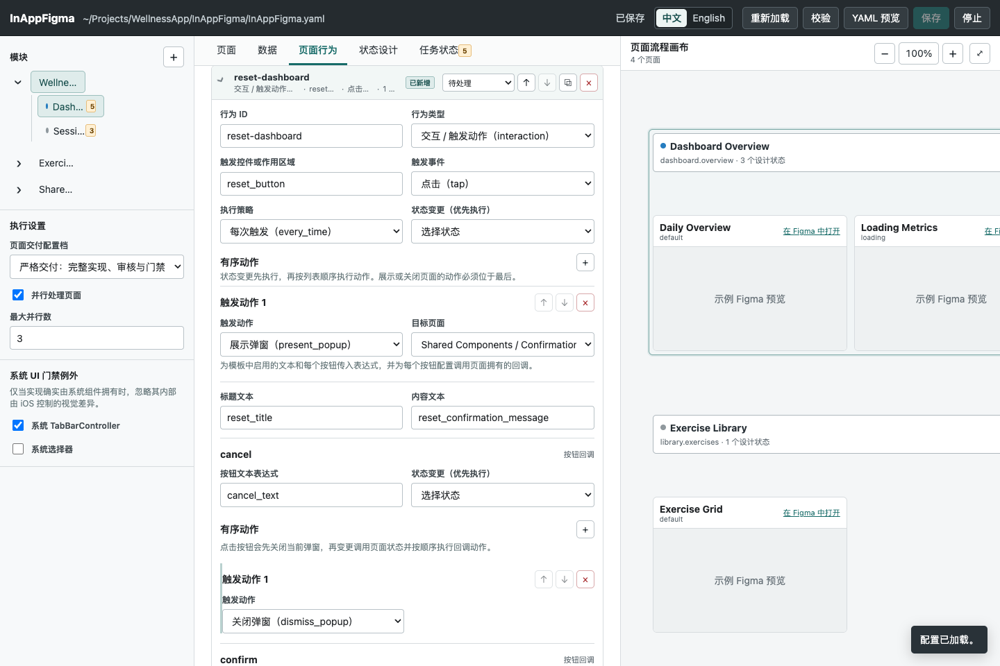
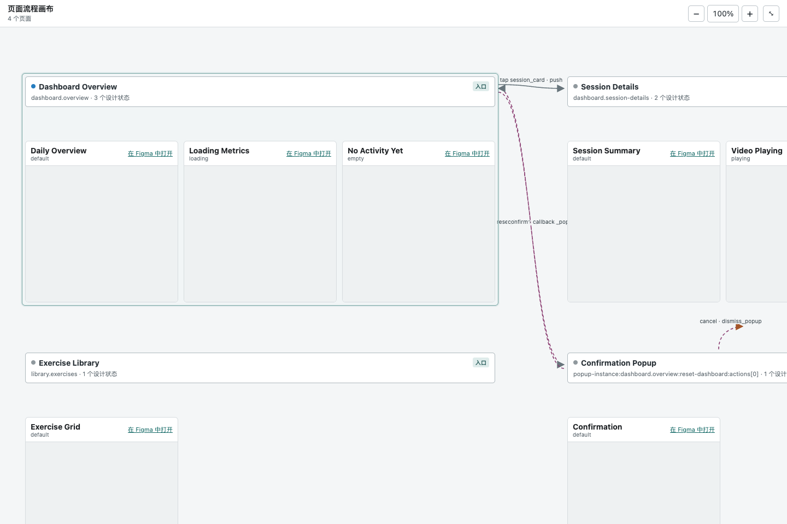

# In-App Swift Figma

[简体中文](README.md) | [English](README.en.md)

`in-app-swift-figma` 是一个 Codex Skill，用于把 Figma 设计落地到现有 iOS App 中的 SwiftUI 或 UIKit 页面。它不会生成与项目割裂的演示工程，而是保留原 App 的架构、导航、生命周期、状态归属、素材、字体、本地化和构建约定。

适用于 App 内页面与组件，不适用于 GeneralOB onboarding 流程和 Web 页面。

## 能力概览

- 默认使用 SwiftUI 实现，并接入 App 已有的 UIKit 路由边界。
- 明确支持 `View` 和 `UIViewController` 两种页面归属方式。
- 提供本地中英双语配置编辑器，用于管理模块、页面、Figma 状态、交互、弹窗、共享 Mock 数据和交付状态。
- 提供可重复执行的页面与子任务生命周期命令，支持实现、评审、修订和验收。
- 对每个设计状态执行严格的视觉验证。
- 对用户明确要求且相互独立的页面/模块，支持基于 Git worktree 的并行交付。

## 环境要求

- macOS、Xcode，以及一个现有 iOS 项目（包含 `.xcodeproj` 或由 workspace 管理的项目）。
- 支持本地 Skill 的 Codex。
- `PATH` 中可用 Git、Ruby 和 Node.js。
- 能访问任务所使用的 Figma 文件和具体节点链接。
- 已明确目标 App 的构建 Scheme 和模拟器设备。

本地编辑器只监听 `127.0.0.1`。发布后的 App 不会读取 `InAppFigma.yaml`。

## 安装方法

### 全局安装

安装一次，供所有 Codex 项目使用：

```bash
mkdir -p ~/.codex/skills
git clone git@github.com:PetterWong-L/in-app-swift-figma.git \
  ~/.codex/skills/in-app-swift-figma
```

也可以使用 HTTPS：

```bash
git clone https://github.com/PetterWong-L/in-app-swift-figma.git \
  ~/.codex/skills/in-app-swift-figma
```

如果 GitHub 要求认证，请先登录所选的 Git 传输方式，并确认当前账号拥有仓库访问权限。日常更新建议使用 SSH。

### 项目级安装

如果团队希望在单个项目内固定并共享同一版本，可安装到项目目录：

```bash
mkdir -p /path/to/project/.codex/skills
git clone git@github.com:PetterWong-L/in-app-swift-figma.git \
  /path/to/project/.codex/skills/in-app-swift-figma
```

当项目中存在 `.codex/skills/in-app-swift-figma/scripts/task_config.rb` 时，生成的编辑器启动器会优先使用项目级 Skill。

### 安装固定版本

克隆后可固定到指定标签：

```bash
git -C ~/.codex/skills/in-app-swift-figma fetch --tags
git -C ~/.codex/skills/in-app-swift-figma switch --detach 1.0.0
```

需要回到最新 `main` 分支时执行：

```bash
git -C ~/.codex/skills/in-app-swift-figma switch main
git -C ~/.codex/skills/in-app-swift-figma pull --ff-only
```

### 更新已有安装

```bash
git -C ~/.codex/skills/in-app-swift-figma pull --ff-only
git -C ~/.codex/skills/in-app-swift-figma fetch --tags
```

安装或更新后，请新建一个 Codex 任务，让 Skill 列表重新加载。

## 快速开始

先为后续命令设置 Skill 路径：

```bash
export IN_APP_FIGMA_SKILL_ROOT="$HOME/.codex/skills/in-app-swift-figma"
cd /path/to/your-ios-project
```

直接向 Codex 描述功能即可。如果希望强制使用此 Skill，请在提示词中明确提到它：

```text
使用 $in-app-swift-figma，把下面几个 Figma 状态实现为现有 iOS App
中的账户详情页。保留当前 UIKit 导航方式，复用项目本地化和设计 token，
并执行 strict 验收流程。

默认态：https://www.figma.com/design/...?...node-id=1-1
加载态：https://www.figma.com/design/...?...node-id=1-2
错误态：https://www.figma.com/design/...?...node-id=1-3
```

单个简单页面可以直接从提示词开始。多页面功能、复用弹窗、共享 Mock 数据、或需要中断后继续的长任务，建议先初始化配置。

## 网页编辑器

Skill 内置了一个只在本机运行的配置网页，用来编辑 `InAppFigma.yaml`，不需要手写复杂 YAML。网页只监听 `127.0.0.1`，使用当前会话的随机 token，并且只写入当前项目的 `InAppFigma/InAppFigma.yaml`。



页面分为四个主要区域：

- **顶部工具栏**：切换中英文、重新加载磁盘配置、校验、预览规范化 YAML、手动保存和停止本地服务。
- **左侧配置大纲**：管理模块与页面、入口页面、交付档位、并行数量，以及经过明确批准的系统 UI 视觉门禁例外。
- **中间页面编辑器**：通过“页面、数据、页面行为、状态设计、任务状态”五个标签编辑当前页面。
- **右侧流程画布**：实时展示页面、设计状态、导航、状态变化和弹窗回调之间的关系。

### 页面与任务编辑

左侧大纲按“模块 → 页面”组织配置。页面标签会根据 `title` 显示确定性的 Swift 文件名；数据标签管理共享 Mock 数据契约；状态设计标签管理每个 Figma 视觉状态；任务状态标签执行 `claim`、`complete`、`fail`、`block`、`requeue` 和 `amend` 生命周期操作。

每个状态、行为和弹窗结构都有自己的 `todo | in_progress | done` 状态。已完成页面发生配置修改时，网页不会直接覆盖验收结果，而是列出受影响任务，并在确认修订后原子保存。

### 页面行为与弹窗回调

“页面行为”标签把触发事件、状态变化和有序动作放在同一张行为卡片中。下图展示了一个确认弹窗：调用页面提供标题、正文、按钮文本及每个按钮的回调；弹窗按钮会先关闭当前弹窗，再执行调用页面的状态变化和动作。



行为卡片可以独立展开或折叠，也可以复制到其他页面。带校验错误的卡片会自动展开，问题会定位到具体字段，而不是只显示难以理解的 YAML 路径。

### 页面流程画布

流程画布根据配置自动生成，不需要手动画线。它会显示：

- 一个页面下的所有 Figma 状态。
- `state_change` 产生的页面内状态边。
- `push`、`sheet`、`full_screen`、`back` 和 `dismiss` 导航边。
- 每次 `present_popup` 对应的独立弹窗实例，以及各按钮回调的后续路径。
- 模块入口、页面状态和未被引用的弹窗模板。

可使用缩放、平移和全屏按钮查看大型流程。点击页面标题会同步选择左侧大纲中的页面；Figma 预览按需加载，避免长任务一次加载全部远程内容。



### 自动保存与冲突保护

合法修改会在停止输入约 800 毫秒后自动保存。保存期间产生的新编辑会进入下一次保存；校验失败时保留当前草稿；如果磁盘配置被其他进程修改，自动保存会暂停并要求重新加载或合并，防止覆盖新版本。点击“停止”只结束本地服务，不会修改页面任务状态。

## 详细使用教程

### 1. 初始化项目配置

可以在任意目录执行，并传入 iOS 仓库根目录：

```bash
ruby "$IN_APP_FIGMA_SKILL_ROOT/scripts/task_config.rb" init \
  --project-root /path/to/your-ios-project
```

初始化只会创建两个开发工具文件：

```text
<project-root>/InAppFigma/
├── InAppFigma.yaml
└── OpenInAppFigma.command
```

命令会拒绝不安全的目录，检查找到的 Xcode 项目文件，并且不会覆盖任何已有文件。务必把这两个文件放在所有 Xcode target、同步源码根目录、Copy Bundle Resources 和项目生成器资源清单之外。

### 2. 打开本地编辑器

在 Finder 中双击 `InAppFigma/OpenInAppFigma.command`，或者从终端启动：

```bash
ruby "$IN_APP_FIGMA_SKILL_ROOT/scripts/task_config.rb" serve \
  --project-root /path/to/your-ios-project
```

常用启动选项：

```bash
# 只打印会话地址，不自动打开浏览器。
ruby "$IN_APP_FIGMA_SKILL_ROOT/scripts/task_config.rb" serve \
  --project-root /path/to/your-ios-project --no-open

# 明确请求任意可用的本地端口。
ruby "$IN_APP_FIGMA_SKILL_ROOT/scripts/task_config.rb" serve \
  --project-root /path/to/your-ios-project --port 0
```

编辑器默认使用中文。可通过工具栏中的 `中文 | English` 切换界面语言。合法修改会在短暂防抖后自动保存，并且具有版本冲突保护。

### 3. 选择交付档位

在编辑器中设置 `delivery.profile`：

| 档位 | 适用场景 | 停止条件 |
| --- | --- | --- |
| `strict` | 从实现到验收的完整交付 | 所有状态、交互、素材、构建和视觉检查通过 |
| `implementation` | 实现和聚焦工程检查 | 代码可供后续评审，页面继续保持 `in_progress` |
| `review` | 评审和验收已有实现 | 已有实现完成验证和验收 |

默认档位是 `strict`。档位只控制工作流阶段，不会改变 App 运行时行为。

### 4. 配置模块和页面

在编辑器左侧大纲中：

1. 添加模块，并选择模块入口页面。
2. 每个用户可见页面只添加一次。同一页面的多个 Figma 链接应作为状态，而不是多个页面。
3. 把 `page_role` 设置为普通 `screen` 或可复用 `popup`。
4. 设置 `page_type`：
   - `view` 生成 `{Title}View.swift`，由现有路由创建系统 `UIHostingController`。
   - `view_controller` 生成 `{Title}View.swift` 和 `{Title}ViewController.swift`，控制器内部嵌入 SwiftUI 的子 `UIHostingController`。
5. 为默认、加载、选中、空数据、错误、重试等视觉状态添加具体节点的 Figma URL。

配置中的页面标题会确定 Swift 类型和文件名。例如 `account security` 对应 `AccountSecurityView.swift`，需要控制器时还会对应 `AccountSecurityViewController.swift`。

### 5. 配置共享开发数据

在根节点只声明一次 Mock 数据源，再由所有消费页面引用：

```yaml
mock_data_sources:
  - id: account-session
    swift_type: AccountSession
    fixture: standard
```

页面通过 `data_dependencies` 声明 `read_only` 或 `read_write`。实现时要在项目已有的组装边界创建一个确定性的 fixture owner，并把同一个实例注入所有消费页面。导航只传 `itemID` 等标识符，不复制完整模型。

YAML 只描述开发契约。fixture 的具体值应写在 Swift 的预览、开发或测试代码中；未来切换生产数据时，只替换 provider，不重写页面 UI。

### 6. 配置行为与交互

行为目标应使用 `submit_button`、`results_list`、`video_player` 等语义名称。支持滚动、固定区域、键盘避让、下拉刷新、分页等布局行为。

一个交互应完整描述一次事件的结果：

```yaml
- id: submit
  type: interaction
  target: submit_button
  states: [default]
  trigger: { event: tap }
  state_change: loading
  actions:
    - type: emit_event
      name: submission_started
  run_policy: every_time
```

实现会先应用 `state_change`，再按声明顺序执行 `actions[]`。动作支持导航、弹窗展示/关闭、倒计时、视频控制、事件发送和自定义行为。

导航配置规则：

- `push`、`sheet`、`full_screen` 必须指向真实的 screen 页面。
- `back`、`dismiss` 只表示将被重新显示的已有页面实例。
- `external` 必须提供 URL。
- 导航到同类型页面的新实例时，添加 `destination_instance: new`。

可复用弹窗应单独配置为 `page_role: popup` 模板。每个调用者负责提供内容、按钮文本和回调。按钮会先关闭当前弹窗，再修改调用页面状态或执行回调动作。

### 7. 校验并查看待办任务

```bash
export IN_APP_FIGMA_CONFIG="/path/to/your-ios-project/InAppFigma/InAppFigma.yaml"

ruby "$IN_APP_FIGMA_SKILL_ROOT/scripts/task_config.rb" validate \
  --config "$IN_APP_FIGMA_CONFIG"

ruby "$IN_APP_FIGMA_SKILL_ROOT/scripts/task_config.rb" list --eligible \
  --config "$IN_APP_FIGMA_CONFIG"
```

校验范围包括 schema 版本、引用关系、目标页面、状态与行为契约、弹窗绑定和生命周期一致性。编辑器会把错误显示在对应字段附近，并提供规范化的 YAML 预览。

### 8. 实现单个页面

标准生命周期如下：

```bash
ruby "$IN_APP_FIGMA_SKILL_ROOT/scripts/task_config.rb" claim account details \
  --config "$IN_APP_FIGMA_CONFIG"

ruby "$IN_APP_FIGMA_SKILL_ROOT/scripts/task_config.rb" changes account details \
  --config "$IN_APP_FIGMA_CONFIG"
```

`claim` 会把可处理页面改为 `in_progress`。`changes` 只输出未完成或发生变化的状态、行为、弹窗结构和删除任务。实现时应严格限定在这些范围内，并保留已经 `done` 的工作。

实现过程中，Skill 会：

- 先检查相邻页面，再决定文件、架构、路由和依赖。
- 除非项目存在明确的 UIKit 限制，否则全页面内容保持 SwiftUI 实现。
- 通过已有 `UINavigationController` 和 `navigationItem` 配置顶层导航，不重复绘制 SwiftUI 导航栏。
- 复用项目已有的本地化、字体、颜色、组件、素材、状态归属和依赖注入方式。
- 使用一个状态驱动的页面 owner 覆盖所有设计状态。
- 不把大范围 `GeometryReader`、`UIScreen` 尺寸、设备判断和固定坐标作为默认布局方式。

### 9. 验证并完成页面

在 `strict` 档位下，仅构建成功并不足以通过验收：

- 检查或导出所有设计素材，并记录复用、新增或无素材证据。
- 在 Figma 参考尺寸及相关最小/最大支持尺寸上渲染每个状态。
- 实际操作进入每个状态所需的交互。
- 使用叠图或其他坐标对比方法比较截图。
- 验证导航、返回手势、安全区、滚动、键盘、本地化、无障碍、路由、共享数据、target membership、聚焦测试和指定 Scheme 构建。
- 修复可见的 `P0` 至 `P2` 问题，并记录被接受的 `P3` 残留。

所有当前任务和删除任务都标记为 `done` 后，完成页面：

```bash
ruby "$IN_APP_FIGMA_SKILL_ROOT/scripts/task_config.rb" complete account details \
  --commit <git-commit> --config "$IN_APP_FIGMA_CONFIG"
```

串行工作没有自动提交时，可按实际情况省略 `--commit`。

无法完成时应记录明确状态：

```bash
ruby "$IN_APP_FIGMA_SKILL_ROOT/scripts/task_config.rb" fail account details \
  --reason "focused build failed" --config "$IN_APP_FIGMA_CONFIG"

ruby "$IN_APP_FIGMA_SKILL_ROOT/scripts/task_config.rb" block account details \
  --reason "missing node-specific Figma URL" --config "$IN_APP_FIGMA_CONFIG"
```

### 10. 修订已验收页面

不要手动重置 `done` 页面。通过具体原因重新打开：

```bash
ruby "$IN_APP_FIGMA_SKILL_ROOT/scripts/task_config.rb" amend account details \
  --reason "Figma updates the error-state layout" \
  --config "$IN_APP_FIGMA_CONFIG"

ruby "$IN_APP_FIGMA_SKILL_ROOT/scripts/task_config.rb" changes account details \
  --config "$IN_APP_FIGMA_CONFIG"
```

修订操作会归档之前的验收信息、保留 accepted baseline，并且只重新打开受影响的任务。在浏览器中修改已完成页面时，也会在用户明确确认后执行相同流程。

### 11. 并行处理独立页面

并行交付必须显式启用。可在提示词中明确提出，或设置：

```yaml
execution:
  parallel: true
  max_parallel: 3
```

只应对至少两个相互独立、文件不重叠且共享边界稳定的页面或模块使用并行模式。工作流会为每个单元创建一个 worktree 和一个提交，共享路由/配置仍由父任务维护，按文档顺序集成，最终再执行一次完整构建。

共享可变 `read_write` Mock 数据或项目元数据有重叠的页面，默认存在依赖，应保持串行。

## 提示词示例

### 实现单个页面

```text
使用 $in-app-swift-figma 实现配置中的 profile.details 页面。
先读取未完成任务差异，保留现有导航和共享 ProfileStore，
然后完成当前 delivery profile 要求的所有检查。
```

### 继续多页面任务

```text
继续这个 iOS 仓库中的 InAppFigma 任务。先校验配置，按文档顺序列出
可处理页面，再继续未完成单元，不要重新打开已经完成的工作。执行模式以 YAML 为准。
```

### 评审已有实现

```text
使用 $in-app-swift-figma，在 delivery.profile=review 下评审并验收已经实现的
checkout 页面。实际操作每个设计状态和交互，将当前渲染与 Figma 对比；
除非我批准修复，否则不要修改源码。
```

### 修订已完成页面

```text
已经验收的 player 页面与新版 Figma 错误态不一致。
使用 $in-app-swift-figma，以此为原因 amend 页面，只实现 changes 报告的差异，
完成要求的聚焦评审后再重新验收。
```

## 常见问题

### Skill 没有被选中

新建一个 Codex 任务，并明确提到 `$in-app-swift-figma`。确认目录名为 `in-app-swift-figma`，且 `SKILL.md` 直接位于该目录中。

### 初始化被拒绝

请从真实 iOS 仓库运行命令，并传入包含 Xcode 项目的仓库根目录。重试前，从 Xcode target membership 中移除对 `InAppFigma.yaml` 或 `OpenInAppFigma.command` 的任何引用。初始化不会覆盖已有文件。

### 编辑器没有打开

使用 `serve --no-open`，手动打开打印出的本地 URL，并确认 Ruby 和 Node.js 可用。服务器只监听本机回环地址，并可能使用随机端口。

### 保存时提示版本冲突

其他进程修改了 `InAppFigma.yaml`。请先重新加载或合并磁盘版本；自动保存会主动暂停，避免覆盖更新内容。

### 已完成页面无法编辑

使用带具体原因的 `amend`，或确认编辑器中的修订对话框。`claim` 和 `requeue` 会有意拒绝 `done` 页面。

### 视觉验收被阻塞

检查是否缺少具体节点链接、素材为空或裁剪错误、状态不可达、模拟器设备不可用、或系统 UI 归属缺乏证据。仅构建成功不能完成 `strict` 页面。

## 仓库结构

```text
in-app-swift-figma/
├── SKILL.md                  # Skill 入口和引用路由
├── assets/                   # 初始任务配置模板
├── docs/images/              # README 网页截图
├── evals/                    # Ruby 和 Node 回归测试
├── references/               # 详细工作流和实现契约
└── scripts/                  # 配置 CLI 和本地编辑器
```

## 开发检查

在仓库根目录运行回归测试：

```bash
ruby -Ievals -e 'Dir["evals/*_test.rb"].sort.each { |file| load file }'
node --test evals/*.mjs
```

部分 Node 测试会临时监听本机回环地址，因此需要本地网络权限。
